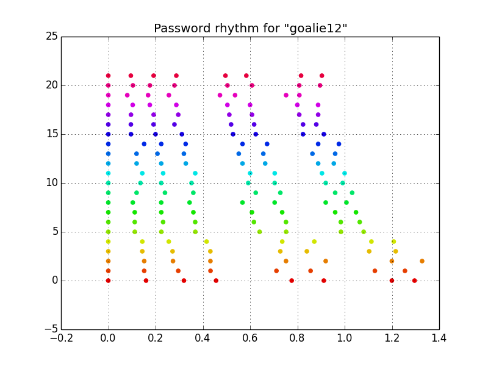
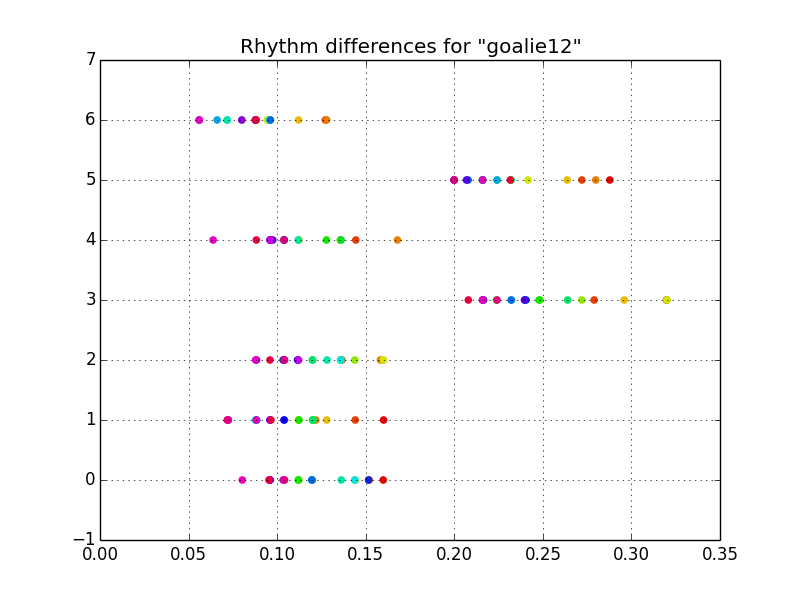
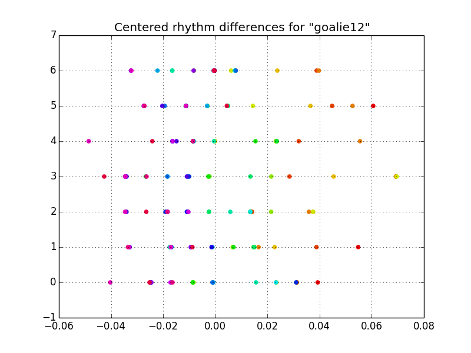
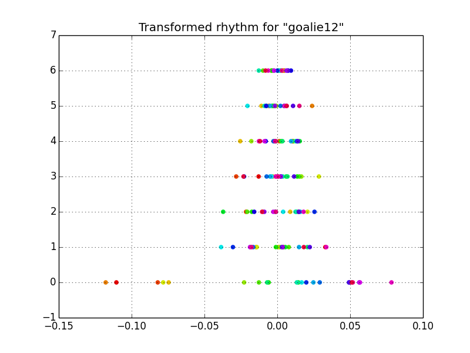
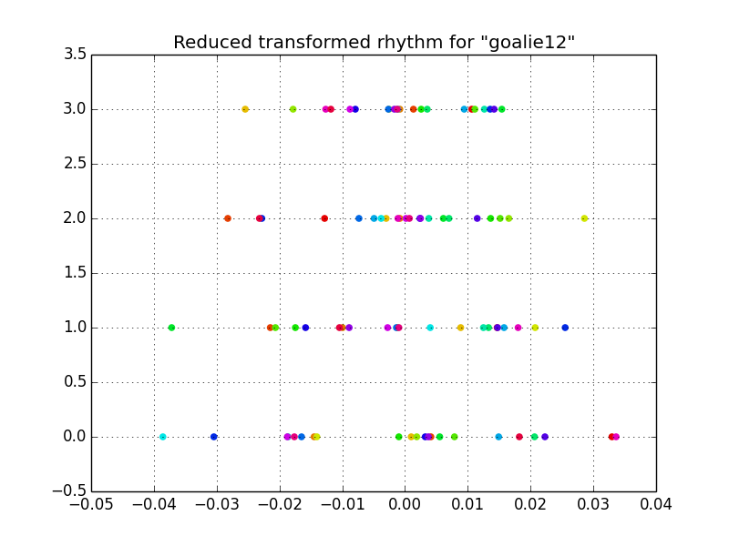
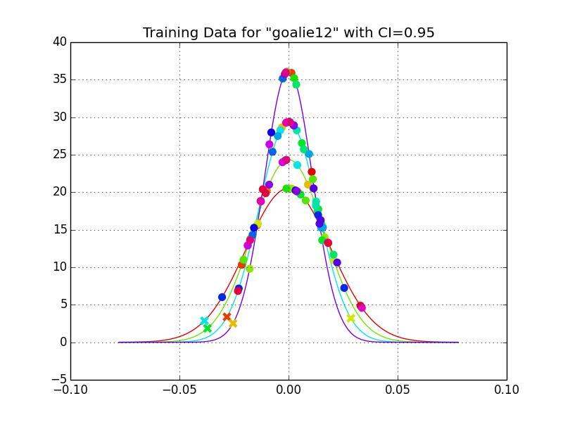
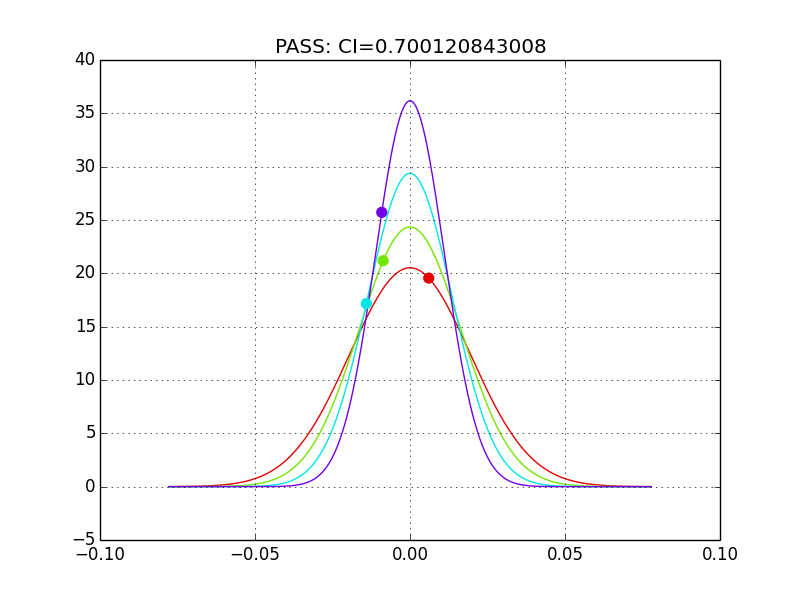
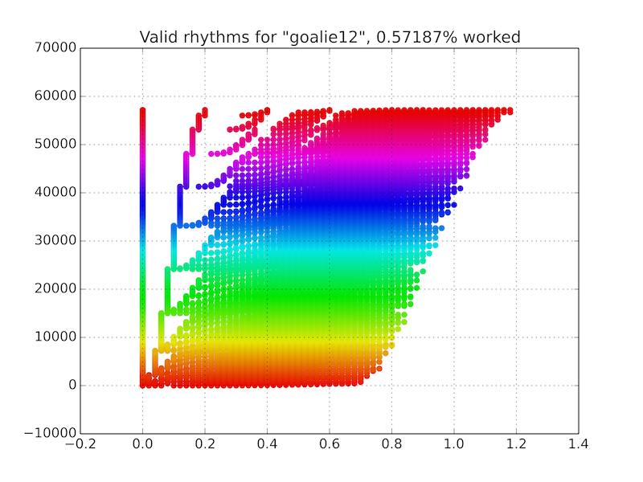

Introduction
============

This software computes a rhythm signature for typed passwords for additional security on user authentication.

How it works
============

The algorithm works by using the time in between key presses as features, centering the data, decomposing the covariance matrix into its eigenvectors, and choosing appropriate eigenvectors to transform the data into independent Gaussian dimensions for testing against a confidence interval.

While a multidimensional Gaussian seems to be a perfect candidate for modelling this data, we would need much more training data than any user is willing to provide. For example, a password that is 8 letters long will have 7 degrees of rhythmic freedom. This mean 7 parameters for the mean and 7+6+5+4+3+2+1=28 parameters for the covariance. That makes 35 parameters to learn. Machine learning best practices is about 10 samples per learned parameter which would require a password to be typed out 350 times before a decent model is learned. This is just not feasible. Thus, I use some approximation methods via eigendecomposition.

Recording
---------

A rhythm is recorded by saving the time of each key-press into an array. The rhythm must be recorded several times - the more the better. This data will be used to train the model and will attempt to learn whatever nuance you throw at it.

This example uses the password, `goalie12`. Note the rhythm associated with the typing. To make sure the model recognizes not just the time of my key-presses but also the relationship of the rhythm, I typed the password slightly slower (the red samples) and slightly faster (the purple samples).

Preprocessing
-------------

The next step is to preprocess the data (note that the data has already been normalizes to that the first key press happens at t=0). With the data in the current format, the value for the time at which any key is pressed is highly dependent on the when the other keys were pressed, thus a Gaussian for each key press would have huge variances (imagine the Gaussian for the last key press in the figure above). So the first thing I do is compute the time between key presses, or the differences between consecutive times. This way, the value for the time between 1 and 2 is independent of the value for the time between all previous key presses. I also center the data by removing the mean.

 

Now things are starting to look a bit more Gaussian. Notice the 2 different speeds of typing from the uncentered data – the gap between l-i, and e-1 become apparent. From here, if we were to fit Gaussians to each feature, we would have something that works, but there is a fault. This model would have a systematic error in failing to account for the covariance of the rhythm. This systematic error is evident by noticing that the red (slowly typed) samples always occur on the right side and the purple (quickly typed) samples always occur on the left side. Without accounting for this covariance, we could type the password faster, then slower, then faster again without failing authentication resulting in a rhythm that doesn’t quite resemble the intended rhythm.

Training
--------

Next is to transform the data to account for this covariance. This is done by doing an eigen decomposition on the covariance matrix and transforming the data into the basis defined by the eigenvectors. This new basis has no covariance leaving us with independent Gaussian features.

Notice how there no longer appears to be systematic error. Now we just need to determine which features are most relevant to rhythm recognition. Realize that although we have transformed the data, the bottom axis is still a measure in seconds.

Feature 0, with the largest variance, has a standard deviation of 0.058 seconds meaning that if we wanted to do a 95% confidence interval test for rhythm detection, this feature is measuring some abstract sense of rhythm that need only be accurate to within 0.116 seconds. Based on the speed at which I type (which is quick), whatever rhythm we hope to capture is going to be repeatable to within less than a tenth of a second.

On the other hand, feature 6 has a standard deviation of 0.006 seconds corresponding to some abstract sense of rhythm accurate to within 0.012 seconds and I cannot type that quickly consistently. Mathematically, this can also be thought of as a singularity or redundancy in the data. This makes sense because there are really only 2 different speeds of typing in the rhythm yet we have 6 features to deal with.

Putting hard constraints on the maximum or minimum standard deviation would not be flexible as some people may type faster or slower than others, and some rhythms may be fast or slow. Thus I have devised a method for eliminating features based on the percent of standard deviation they contribute to the data. For each feature, I divide its standard deviation by the sum of the standard deviations for all features. Then, for this example since there are 7 features, we are interested in the features that contribute to about 1/7th of the standard deviation of the data by comparison to the rest. I then find all features that have between 1/7+1/14 and 1/7-1/14 percent standard deviation of the data and these are the dimensions that best capture the rhythm.

Aside: An interesting way of understanding this eigen decomposition is by considering 2 covarying features. For rhythm detection, we are most interested in the relative ratio of these these two time features (the smaller eigenvector) as opposed to the minimum/maximum values of these time features (the larger eignvector).

After reducing the feature space in such a way, we are left with features that vary with a reasonable amount of time for human typing. In this case, 4 independent gaussian features.

The training data can be plotted against the each Gaussian probability density function. For this example, features that do not pass the 95% confidence interval test are displayed with an “x”. This confidence interval measure could be adjusted by the user according to the repeatability of the rhythm and the amount of security desired.

Authentication
--------------

In testing a password rhythm for authentication, the key-press timings are transformed into these independent Gaussian features. The confidence interval for each Gaussian is computed independently and compared to some risk or tolerance specified by the user, in this case a 95% test works pretty well. If any of the features are outside this confidence interval tolerance, then authentication fails.

Security
--------

In terms of security, it is not easy to analytically determine the additional amount of security but heres an attempt to make a cracker user a reasonable heuristics.

This is a very basic 8 letter password which, using a password dictionary, wouldn’t be terribly difficult to crack. However, there are now 7 additional numbers needed for verification. A heuristic of intelligently cracking these rhythm features would first start of with an assumption of the precision of the rhythm. In the case of goalie12, we can see that the smallest standard deviation of the reduced features is 0.011 seconds so iterating the time of key presses by 0.02 seconds should be able to capture a rhythm that passes this test. The upper bound now becomes a bit more subjective. What is the longest consistent time between keys possible for a rhythm? From the plots above, it seems that about 0.2 seconds is reasonable for this case (mistake: should have done 0.3 or 0.4, but that ends up not mattering). That leaves 107 or 7 million combinations to try.

After running through all combinations (took about 30 minutes with 8 cores), we are left with rhythms that successfully authenticated.

There are a few things to realize here. There were a lot of rhythms that aren’t even humanly typable that passed authentication. This is due to the loss of dimensionality when reducing the feature set. However, these were rather similar rhythms nonetheless. 

The rate at which this cracker could find rhythms to autenticate was about 0.0057187. This is equal to about 1 in 175 guesses which is about 7.5 bits of information. This is roughtly equivlent to adding 1 or maybe 2 more characters to your password. The question at this point is whether this rhythm authentication is even worth the hassle when you could simply ask users to add 2 more characters to their password? This works great for preventing humans from getting into your computer even if they know the password. However, its not so hard for computers.
